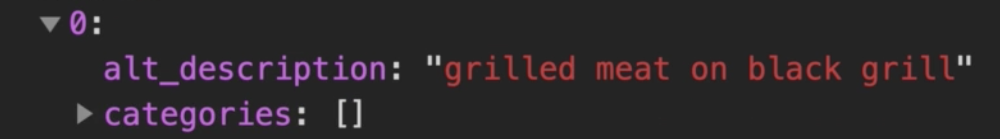
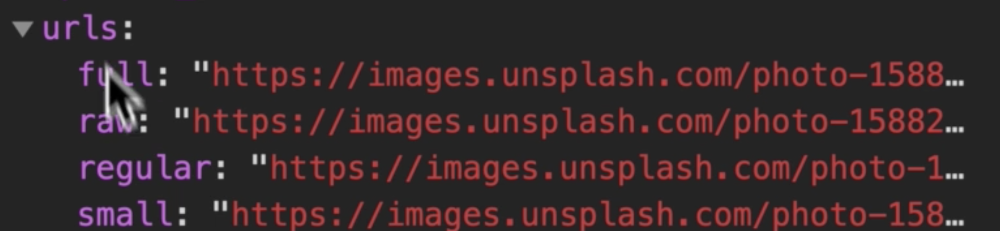
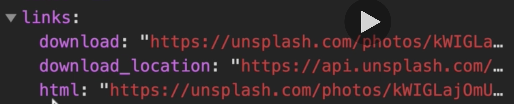
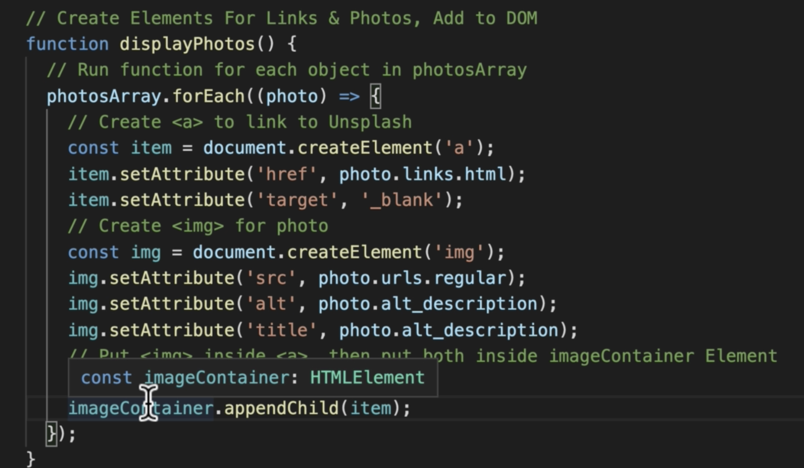

So what we've done so far is 
1.	We have our get photos method 
2.	using our fetch request with the parameter of our API URL which we built to include our API key.
3.	we're contacting the UNSplash server and 
4.	that is returning a response that we set to a constant of data.
a.	we're actually going to change that up a little bit.
5.	So we're going to have a global variable called Photos Array. 
6.	we're going to pass the data into that photos array 
7.	within our display photos method, we will also call that photos array.
8.	And we will use the for each method on it to run a function for every element within the array.
9.	And we will use that to create our each HTML elements for each object.

So there are many properties being returned in each of the objects, but these are the three that we
are going to use for our purposes.
1.	we're starting with an anchor element that is wrapping an image element. 
2.	The anchor element is pointed to the links.html.
a.	When user clicks on image, goes to that image on Unsplash’s website
b.	The image itself is having its source dictated by the regular URL.
i.	So you could use a bigger file if you wanted.
3.	And we're also populating the alt and title attributes with the alt description.
a.	When a user hovers over the image, they will see the description.


OK, so first, we're going to start by creating a few constants at the very top.
So we're going to create first our image container and then we'll be equal to document.
Get element by I.D..
And image dash container.
And we'll also have one for our loader while we're at it, but we're not going to use our loader for a little while.
OK, and below that, we're gonna create our photos array as our global variable.
This time we're going to use a let instead of a constant because the value within our photos array is going to change every time we make a request.
So that is going to be equal to square brackets, meaning an empty array.
So let's now jump into you.
Ah, get photos function and we're gonna get rid of our.
Data here.
And instead of using Constanta, as I said, we will just type in photos array.
Can see it auto completes if I press enter their.
And actually below that, we'll have a console log just to make sure that we're getting our photos array
being populated properly.
OK, so let's save that and check it out.
OK, so we can see that we have 10 items here.
And yeah, it's working with console logging, our photo array.
Perfect.
# So we can start building our second function now.
So back in the code within our get photos method, we can remove our console log and instead we're going to call our function display photos.
We haven't made it yet, but let's make that now.
So we're gonna make that above or get photos function.
```displayPhotos();```
Let's start by commenting at a title with the intended functionality.
So we're going to create elements.
For links.
And photos.
And we're gonna add that to the dome, so 
# Function Display photos
- OK, so within our display photos method, we're going to comment out a title for our for each method.
- And so we're going to use our photos array dot for each bracket.

```photosArray.forEach((photo) => {```

- We're gonna pass in our variable name `photo`, 
## so that means that each object is going to be assigned to the `photo` variable as we are running through our for each method.

- We're going to create an `arrow function`.
- And then our curly brackets.

## Creating our elements with what we had in our photos array.

So, for example, this is the first one of the elements within our photo array.

### You can see that we want our ult description.

### And we want our links dot HMO 

### We want our You Earles Dot regular.


So let's jump back and take care of that.

And we're going to make a constant item, which is going to equal document, dot, create element:
And in brackets, we're going to put single quotes.
And then a.

```const item = document.createElement('a');```

`Creates a blank anchor element.`

## Set some attributes on this item.

So we're going to do item dot.
Set attribute, bracket.
Single quote.
And we're setting the href attribute, comma.
And then we're going to provide what we're gonna actually set it with.
So in this case, `href: photo.links.html` 

And we're also going to want this to open in a new window.
So we're going to set another attribute.
This time we're referring to the target, comma, and then single quotes again.
We're going to pass in a string, underscore blank and they'll open it in a new tab: `target: '_blank'`

OK.
```
setAttributes(item, {
      href: photo.links.html,
      target: '_blank',
    });
```
That's it for our item.

## Similar process for our image 
And we're gonna set a constant called img for image, same thing.
Document, create element.
And we're going to this time use an image: `const img = document.createElement('img');`

Then we're going to set some attributes again: `setAttributes(img, {`

This time, we need to start with these source, because that's what's actually going to load the image
and we're going to use photo, dot your URLs, dot regular: `src: photo.urls.regular,`
Then the next attribute is going to be our alt attribute, which is going to be photo.alt Underscore
Description: `alt: photo.alt_description,`
We can actually copy this because it's going to be similar.
And we're going to paste that and we're just going to change Alte here to be our title attribute: `title: photo.alt_description,`

And the very last thing we're gonna need to do.
We're a title for it is we're going to put the image inside.
The anchor element, like we had in our diagram, and then we're going to put both inside of our image
container.
Element.
So in order to do that, we're going to start with our item, which is going to be the parent of our
image.
And we're going to `appendChild`.

```
So we're going to add a child.
And that is going to be our image constant.
```

And we'll do a similar thing this time.
The image container is the parent and we're going to spend the child.
That is the item.


So that's pretty much it for that functionality.

# OVERVIEW



## What's going to happen is 
- For each item in this array
- We're going to run through this every single time.
- Create an item.
- Create an image.
- Put our image into our item.
- Put our item into our image container.

OK, so we can see that's a little weird, looks like we have our same three images, but we scroll
down.
Oh, we have our other images.
It's working.
We're actually loading our other images from UN Splash.
And you can see if we hold over it, we can see we have our title here with our description.
That's amazing.
So the one thing we will need to do is actually delete the place.
Older images we had.
So let's jump back to our HD, Amal and do that.
So we're going to delete all these.
Because we're going to populate this entire image container dynamically in our JavaScript.
So let's save that and jump back.
OK.
Amazing.
We have our unsurpassed images loaded.
We have our description, as you can see.
And if we actually click on it, it takes us to the UN's splash Web site.
You can see the user that created the image and we have some options to download the image.
And that is amazing.
That's exactly the functionality that we wanted.

## But I think we can make the implementation a little bit better.

So back in the code, we can actually improve our set attributes here.
An important tenant of modern development is creating dry code.
So `dry` stands for `don't repeat yourself`.

So in this case, instead of repeatedly typing out the set attribute method, we can actually create
a `helper function` that will do this for us so we can create it above our display photos function.

```
// Helper Function to Set Attributes on DOM Elements
function setAttributes(element, attributes) {
  for (const key in attributes) {
    element.setAttribute(key, attributes[key]);
  }
}
```

- name the function `setAttributes`
- pass in two parameters.
  -  One is going to be the `element`.
  -  And the other is going to be the `attributes`.
  -  And we're going to use a `for loop` to loop through for each of the attributes you want to set.

- start by assigning the `key` constant.
-  So that's going to be the href target source alt title 
-  In `attributes`, which is going to be an `object`
containing both the 
  -  `key` and the 
  -  `value` we actually want to set.

- And we're going to pass in the elements: `element.setAttribute(key, attributes[key]);`
  - That'll be our `item` or `image`
- then we're gonna run the regular set attribute method 
- and we're gonna pass in the 
  -  key, as well as the 
  -  attribute with the index of that specific key.

```
  function setAttributes(element, attributes) {
  for (const key in attributes) {
    element.setAttribute(key, attributes[key]);
  }
}
```


## Make some changes within our display photos method as well.
 
- we're going to call our set attributes function that we just made.

- We're going to pass an item first, then comma, then curly brackets to create our object.
- The semicolon before we forget and we're going to have a trough as our first key and then we're going
to have the same thing we had above, which is photoed dot link, stutt H Timmo comma, and then the
target will be our next key.
And again, we're going to pass in the same thing, underscore blank and then another comma.
 
```
setAttributes(item, {
      href: photo.links.html,
      target: '_blank',
    });-
```
And we'll do the same thing below for our image.

- call set attributes, pass in image is our element.
Comma, 
- curly brackets for object, 
- add the semicolons.
And this time we are having our 
- source as our first key.

```
  const img = document.createElement('img');
    setAttributes(img, {
      src: photo.urls.regular,
      alt: photo.alt_description,
      title: photo.alt_description,
    });
```

And we can save it and see if it works.
OK, so you can see that we have some new images here.
It's working perfectly.
That is excellent.
And we can see here that our code is no longer repeating itself.
Perfect.

# Next video, we'll be looking at actually adding our infinite scroll functionality.
 

